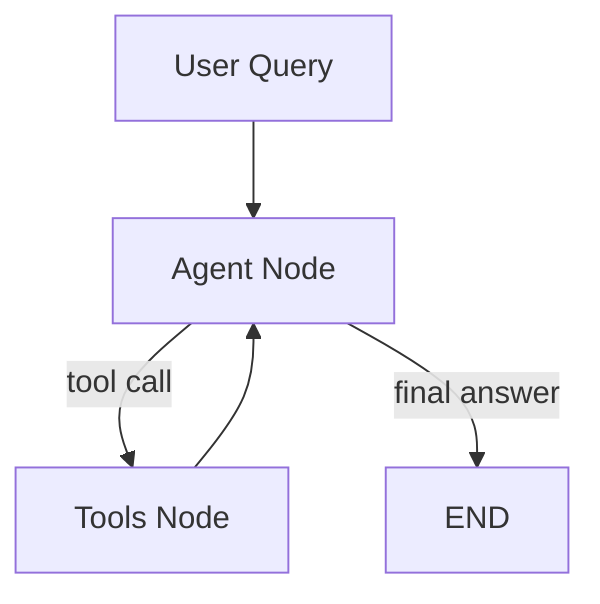

# Financial Document Intelligence — Design Decisions

## 1. Ingestion Pipeline

### 1.1 Document Loading

**Options:**
- **Simple extraction** (pypdf, pdfplumber) — extract raw text, fast, minimal dependencies
- **Layout-aware extraction** (unstructured.io, Amazon Textract) — preserves tables, columns, headers
- **OCR-based** (pytesseract) — for scanned/image-based documents

**Considerations:** Documents are Apple 10-K (SEC filing), JPMorgan annual report, HSBC annual report, AIA annual report. These are digitally generated PDFs, contain tables, charts, and multi-column layouts.

**Design Decision:** pypdf

**Reasoning:** Handles data of interest (generated pdfs of 10-K (SEC filing) and annual report) well enough, table layouts are flattened so Layout-aware extraction is unnecessary as downstream chunking step converts everything to plaintext regardless. The pdfs are not scanned so OCR-based tools not applicable. 

**Future Work:** If evaluation shows poorly performing retrieval on table-heavy sections then might consider upgrading to pdfplumber or unstructured.io. 

---

### 1.2 Preprocessing

**Options:**
- **None** — raw text straight to chunking
- **Minimal cleaning** — remove repeated headers/footers, page numbers, table of contents
- **Section splitting** — split by document sections (e.g. "Risk Factors", "MD&A", "Financial Statements") before chunking
- **Metadata extraction** — programmatically pull company name, report year, section headers

**Considerations:** Financial reports have repeating headers/footers on every page, page numbers, and structured sections. Section splitting improves retrieval but assumes consistent document structure across different report formats.

**Design Decision:** Minimal cleaning — remove repeated headers, footers, and page numbers. 

**Reasoning:** Strings get embedded as chunks and pollute retrieval results without cleaning. Section splitting is skipped because documents span different formats — US 10-K, UK annual reports, Asian corporate reports. Assuming consistent section structure would break on at least one format.

**Future Work:** Programmatic metadata extraction (company name, section headers) requires format-specific parsers that would break across diverse document types and is deferred to future improvement. Basic metadata handled in the metadata attachment step.

---

### 1.3 Chunking Strategy

**Options:**
- **Fixed-size** (CharacterTextSplitter) — split at every N characters regardless of content
- **Recursive** (RecursiveCharacterTextSplitter) — split by paragraph → sentence → word hierarchy
- **Semantic** — split based on topic shifts detected by embedding similarity
- **Document-structure-aware** — split by headings/sections first, then chunk within

**Parameters to decide:**
- Chunk size: 250 / 500 / 750 / 1000 tokens
- Overlap: 0 / 50 / 100 / 200 tokens

**Considerations:** Financial text mixes narrative paragraphs (MD&A, Risk Factors) with dense tabular data (financial statements). A chunk size that works for narrative may be wrong for tables.

**Design Decision:**  RecursiveCharacterTextSplitter, 500 tokens ~2000 characters chunk size, 400 character overlap (20% of chunk size)

**Reasoning:**  RecursiveCharacterTextSplitter splits by hierarchy which preserves semantic coherence in structured financial documents. 2000 characters is roughly 1-2 paragraphs, it is small enough for topically focused embeddings that match specific queries, large enough to be self-contained with sufficient context. 400-characters overlap (20% of chunk size) prevents information loss at chunk boundaries. If a key sentence falls exactly at a split point, it would otherwise be cut across two chunks with neither chunk containing the full statement. Overlap ensures the sentence appears intact in at least one chunk.

**Future work:** Validate chunk size empirically by running the eval suite against 1000/2000/4000 characters configurations and comparing retrieval precision metrics.

---

### 1.4 Metadata Attachment

**Options:**
- **Minimal** — source filename, page number
- **Standard** — source filename, page number, company name, report year, document type
- **Rich** — all of the above + section name, chunk summary, extracted keywords
- **Derived** — LLM-generated summary per chunk (expensive, slow, but high quality)

**Considerations:** Metadata enables filtered retrieval at query time. Richer metadata = better retrieval but more ingestion logic.

**Design Decision:** Standard — source filename, page number, company name, report year, document type

**Reasoning:** Agent needs filtered retrieval by company name and must cite source file, date, and page number. A metadata config file (`metadata.json`) maps each document to its company name, year, and document type. pypdf provides page numbers during extraction. Config-based approach is more robust than filename parsing for real-world documents with inconsistent naming.

**Future work:** Rich/derived metadata deferred as future improvement.

---

### 1.5 Embedding Model

**Options:**
- **all-MiniLM-L6-v2** — 384 dims, fast, free, local, no API cost. Standard prototyping choice.
- **BGE / E5 / GTE models** — higher quality embeddings, larger models, slower, still free/local
- **OpenAI text-embedding-ada-002** — cloud, paid per call, high quality
- **Cohere embed** — cloud, paid, multilingual strength

**Considerations:** English-language financial reports. Prototype vs production tradeoff. Local models have zero marginal cost. Cloud models add latency and cost but may improve retrieval quality.

**Design Decision:** all-MiniLM-L6-v2

**Reasoning:** all-MiniLM-L6-v2 is lightweight, free, local, well-documented, and sufficient for prototyping. Retrieval quality at this stage is bottlenecked by chunking and metadata strategy, not embedding model quality.

**Future work:** If eval results show poor retrieval precision after tuning other parameters, upgrade to BGE or E5, it is just a matter of single-line config change.

---

### 1.6 Vector Store Configuration

**Options:**
- **Single collection** — all documents in one collection. Simple. Supports cross-document queries natively.
- **Per-document collection** — one collection per PDF. Isolation. Cross-document queries require multiple searches and merging.
- **Per-company collection** — one collection per company. Middle ground.

**Considerations:** Needs to answer both single-document questions ("What was Sony's revenue?") and cross-document questions ("Compare X and Y 's revenue").

**Design Decision:** Single collection — all documents in one collection.

**Reasoning:** Single collection supports cross-document queries natively (e.g. "compare Apple vs HSBC risk factors"). Single-document queries are handled by metadata filtering e.g. company_name=Apple which narrows the search space without needing separate collections. Simpler to maintain than per-document or per-company collections with no loss of functionality.

---

### 1.7 Indexing Strategy

**Options:**
- **Flat** — one embedding per chunk, stored directly. Simple, standard.
- **Parent-child** — embed small chunks for retrieval precision, but return the larger parent chunk for more context in the prompt.
- **Hypothetical questions (HyDE)** — generate questions each chunk could answer, embed the questions instead. Query matches question-to-question rather than question-to-passage.
- **Multi-vector** — store multiple representations per chunk (summary embedding + full text embedding)

**Considerations:** Flat is the standard starting point. Advanced strategies are interview talking points for "what would you improve?" but add complexity.

**Design Decision:** Flat — one embedding per chunk, stored directly.

**Reasoning:** Standard approach, sufficient for prototyping. Each chunk gets one embedding and is retrieved as-is

**Future work:** Parent-child indexing — embed smaller chunks (~200 tokens) for more precise vector matching, but retrieve the larger parent chunk (~1000 tokens) to give the LLM more surrounding context. Trades storage and complexity for better retrieval precision paired with richer answer context.

---

## 2. Retrieval Strategy

### 2.1 Search Method

**Options:**
- **Pure vector search** — cosine similarity between query embedding and stored embeddings
- **Hybrid search** — vector search + BM25 keyword search, results merged (reciprocal rank fusion)
- **Filtered search** — vector search with metadata filters applied first (e.g. company=Apple)

**Considerations:** Pure vector search can miss exact keyword matches — the embedding may not capture the acronym precisely. Hybrid search catches what embeddings miss.

**Design Decision:** Pure vector search with metadata filtering

**Reasoning:**  Cosine similarity handles semantic queries. Metadata filters (company name, report year) narrow the search space when the query targets a specific document. ChromaDB supports metadata filtering natively. ChromaDB doesn't support hybrid search natively, so adding it means building and maintaining a parallel keyword search system. It has marginal benefit at the scale of this project.

**Future work:** Adding BM25 keyword search alongside vector search using reciprocal rank fusion to catch exact term matches that embeddings miss (Hybrid Search).

---

### 2.2 Top-K Selection

**Options:**
- **k=1** — single most relevant chunk. Minimal noise, risk of missing information.
- **k=3** — standard. Balance of relevance and coverage.
- **k=5** — broader coverage, more noise, higher token cost in prompt.
- **Dynamic k** — adjust based on query type or confidence scores.

**Considerations:** More chunks = more context for the LLM but also more noise and token cost.

**Design Decision:** k=3

**Reasoning:**  k=1 risks missing relevant info. k=3 retrieves ~6000 characters (~1500 tokens) of context which is enough coverage without dominating the prompt. k=5 adds noise with diminishing returns. Dynamic k deferred as overkill for this version.

---

### 2.3 Similarity Metric

**Options:**
- **Cosine similarity** — measures angle between vectors. Standard for normalized embeddings.
- **Euclidean distance** — measures absolute distance. Sensitive to magnitude.
- **Dot product** — fast, works when embeddings are normalized.

**Design Decision:** Cosine similarity

**Reasoning:** Industry default. sentence-transformers produces normalised vectors so cosine and dot product are equivalent. No reason to deviate.

---

## 3. Agent Design (LangGraph)

### 3.1 Agent Architecture

**Options/Consideration:**
- **Single agent** — one LangGraph StateGraph handles all queries. Routes to tools as needed.
- **Router + specialist agents** — router agent decides query type, delegates to specialised agents (e.g. retrieval agent, calculation agent, comparison agent).
- **ReAct pattern** — agent reasons step by step, calling tools iteratively until it has enough information.

**Design Decision:** Tool-calling agent (LangGraph StateGraph with structured tool schemas).

**Reasoning:** Structured tool calls give predictable, debuggable behavior; the agent either calls a defined tool or gives a final answer. More controlled than ReAct (no unpredictable looping), simpler than multi-agent (overkill for this scale). Tool schemas constrain output format, which helps enforce citation requirements for financial documents.

**Future work:** Add reflexion/self-critique node — a second LLM pass that verifies the answer is grounded in retrieved sources and flags potential hallucinated figures. Critical for financial accuracy. Designed as a toggleable node in the state graph.

---

### 3.2 State Definition

What goes in the agent's TypedDict state

**Design Decision (which fields and why):** Minimal — `messages: list` only, following LangGraph's standard pattern.

**Reasoning:** Messages list tracks the full agent loop within a single query: the user's query, tool calls, tool results, and the final answer are all message types. All data flows through messages, so separate fields are redundant. This follows LangGraph's standard pattern. Additional fields added only if a specific need arises during development.

---

### 3.3 Tools

**Options for tool set:**
- **search_documents** — RAG retrieval from ChromaDB
- **calculate** — numerical computation from extracted financial data
- **compare_companies** — cross-document comparison
- **get_summary** — generate summary of a specific document/section
- **get_metadata** — return available documents, companies, years

**Design Decision:** `search_documents` and `get_metadata`

**Reasoning:** `search_documents` is the core RAG retrieval and the agent can't answer without it. `get_metadata` tells the agent what documents and companies are available, preventing hallucinated answers about missing data. Other tools (calculate, compare, summarise) can either be handled natively by the LLM or achievable by calling `search_documents` multiple times with different filters. Fewer tools means fewer wrong decisions by the agent.

**Future work:** Add a `calculate` tool if eval results show the LLM makes arithmetic errors on financial figures.

---

### 3.4 Graph Flow

**Design Decision:**

Flow: User query enters Agent node. Agent decides to either call a tool or give the final answer. If tool call, the Tools node executes it and returns the result to Agent. Agent re-evaluates: call another tool or answer. Loop continues until Agent responds without a tool call, which triggers END.

**Reasoning:** Agent is the sole decision-maker, deciding what tool to call and when it has enough information to answer. Simple two-node graph is debuggable via Langfuse traces and follows LangGraph's standard pattern.

---

## 4. Context Engineering

### 4.1 System Prompt Design

**Considerations:**
- What persona/role does the LLM take?
- What instructions govern citation behavior?
- What constraints on answer format?
- How do you prevent hallucination?

**Design Decision (key elements of your system prompt):** Financial analyst persona. Must cite sources (company, document type, year, page). Must refuse to answer if context is insufficient. No fabricated data.

**Reasoning:** Financial use cases require grounded, verifiable answers. Citation requirement ensures traceability. Refusal instruction prevents hallucination on questions outside the provided context.

**Chosen system-prompt text:** "You are a financial document analyst. Answer questions based only on the provided context. Cite your sources with company name, document type, year, and page number. If the context doesn't contain enough information to answer, say so — do not make up data."

---

### 4.2 Memory Strategy

**Options:**
- **No memory** — each query is independent, no conversation history
- **Full history** — append all previous messages to every request
- **Sliding window** — keep last N messages, discard older ones
- **Summary memory** — periodically summarize older messages, keep summary + recent messages

**Design Decision:**  No cross-query memory, each query is independent.

**Reasoning:** The agent's state (messages list) already tracks tool calls and results within a single query. Cross-query memory (remembering previous questions) adds sliding window logic and token budget management which is complexity that doesn't improve core functionality yet. 

**Future Work:** When conversation-based queries become a requirement, add sliding window (last 5 messages) for follow-up questions like "What about HSBC?" after asking about Apple.

---

### 4.3 Token Budget Management

**Options:**
- **No management** — send everything, hope it fits
- **Hard truncation** — cut oldest messages when exceeding limit
- **Priority-based** — system prompt > retrieved chunks > recent messages > older messages
- **Adaptive** — measure token count before each call, adjust retrieved chunks or history dynamically

**Considerations:** LLM's context window is large but not infinite. Retrieved chunks + conversation history + system prompt can exceed limits on complex queries.

**Design Decision:** No management needed for this version.

**Reasoning:**With k=3 chunks (~6000 characters), a system prompt, and a single query, total input stays well within Claude's context window. 

**Future Work:** Token budget management becomes necessary when conversation memory adds variable-length history; deferred until memory is implemented.

---

### 4.4 Chunk Formatting in Prompt

**Options:**
- **Raw text** — just paste chunks into the prompt
- **Labelled** — each chunk wrapped with source metadata: `[Source: Apple 10-K 2025, Page 47] <chunk text>`
- **** — formal structure the LLM can parse: `<source company="Apple" page="47">...</source>`
- **Numbered** — `[1] chunk text... [2] chunk text...` so LLM can reference by number

**Considerations:** The LLM needs to know where each chunk came from to generate citations. Format affects citation accuracy.

**Design Decision:**  Labelled — each chunk wrapped with `[Source: {company}, {document_type}, {year}, Page {page}]`

**Reasoning:** The LLM needs source metadata to generate accurate citations. Labelled format is human-readable and gives LLM exactly the fields needed for citation. Raw text makes citation impossible. Structured XML adds parsing complexity with no benefit.

---

## 5. LLM Backend

### 5.1 Primary Model

**Options:**
- **Claude (Anthropic API)** — your primary choice. Sonnet for speed/cost, Opus for quality.
- **GPT-4o (OpenAI API)** — alternative, different strengths
- **Open-source via vLLM** — Mistral-7B, LLaMA-3-8B. Local, private, lower quality. (Deferred)

**Design Decision:** Claude - Sonnet

**Reasoning:** Claude model as this project utilises Claude Code so it is consistent toolchain. Haiku is more cost efficient but weaker on complex reasoning for financial documents; Opus is advanced but expensive; Sonnet serves at the balanced middle ground. Layer abstraction is a feature so model swapping is just one minor config change.

---

### 5.2 Abstraction Layer Design

**Considerations:**
- How do you structure the code so swapping from Claude API to vLLM (or any other backend) requires changing one config value, not rewriting the agent?
- Interface: what methods does your LLM wrapper expose?
- Where does the API key / endpoint URL come from? (Environment variables, config file, etc.)

**Options:**
- All-in-one: LLM wrapper takes query + chunks, assembles prompt internally, returns answer. Fewer files, faster to build.
- Clean separation: Context layer assembles the prompt, LLM wrapper just takes a formatted prompt and returns a response. Each component does one thing.

**Design Decision (interface design):** Separate context assembly (`src/context/`) from LLM calling (`src/llm/`). LLM wrapper exposes a `generate(prompt: str) -> str` method. Reads API key from `os.environ["ANTHROPIC_API_KEY"]`. Model name configurable via constructor parameter.

**Reasoning:** Context assembly and LLM calling are separate concerns, context decides what to send, LLM wrapper decides how to send it. Swapping models or prompt strategies independently without touching the other.

---

## 6. API Design (FastAPI)

### 6.1 Endpoints

**Design Decision:** Four endpoints — POST /query, POST /ingest, GET /documents, DELETE /documents.

**Reasoning:** Covers the full user workflow: upload documents, check what's available, ask questions, and remove documents. No PUT/PATCH as updating individual chunks isn't meaningful since chunking is a pipeline output. To update a document, simply delete and re-ingest.

---

### 6.2 Request/Response Schema

**Design Decision:**

POST /query:
  Request: { "query": str }
  Response: { "answer": str, "trace_id": str }

POST /ingest:
  Request: multipart form — PDF file + company_name (str) + report_year (int) + document_type (str)
  Response: { "status": str, "chunks_created": int }

GET /documents:
  Response: { "documents": list of { company_name, report_year, document_type } }

DELETE /documents:
  Request: { "company_name": str, "report_year": int (optional) }
  Response: { "status": str, "deleted": bool }

**Reasoning:** Query takes only the question string; the agent decides search scope and filters internally based on the query content. Ingest uses multipart form to support file upload alongside metadata. Response includes trace_id for Langfuse trace inspection. Error responses follow standard HTTP status codes (400, 404, 500).

---

## 7. Observability (Langfuse)

### 7.1 What to Trace

**Options:**
- **LLM calls only** — log prompt, completion, latency, tokens, cost
- **Full pipeline** — trace from query receipt → retrieval → context assembly → LLM call → response
- **With scores** — attach quality scores to traces (manual or automated)

**Considerations:** Full pipeline tracing is the production standard. It lets you debug where failures occur — was it bad retrieval, bad context assembly, or bad LLM output?

**Design Decision:** Full pipeline tracing with scores. Trace retrieval, context assembly, and LLM calls. Attach quality scores to traces when eval suite is built. Trace from query receipt → retrieval → context assembly → LLM call → response.

**Reasoning:** A bad answer could be bad retrieval, bad prompt formatting, or bad LLM output. Tracing each step separately tells you which one broke. Combined with score, filtering for low-scoring traces and diagnosing exactly where the pipeline failed would be possible.

---

### 7.2 Integration Points

Where in your code do you add Langfuse instrumentation?
- At the API layer (request in, response out)?
- At the retrieval layer (query, results, latency)?
- At the LLM layer (prompt, completion, tokens)?
- At the agent layer (tool decisions, state transitions)?

**Design Decision:** Trace retrieval, context assembly, and LLM calls.

**Reasoning:** Covers the full query path. API layer tracing will be added when FastAPI endpoints exist.

---